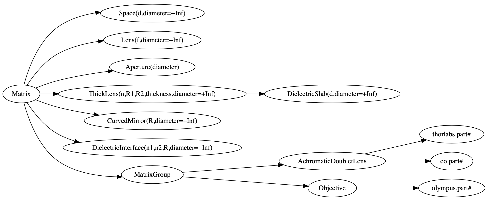
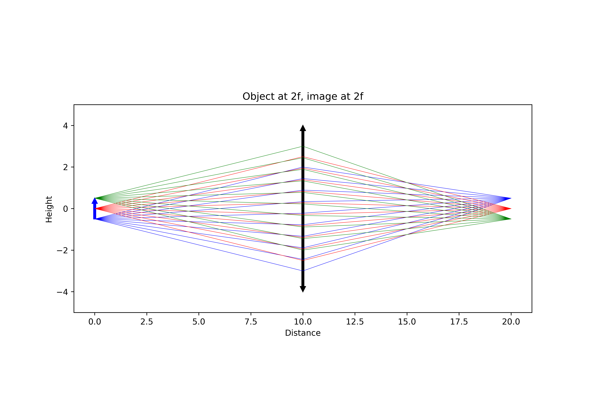
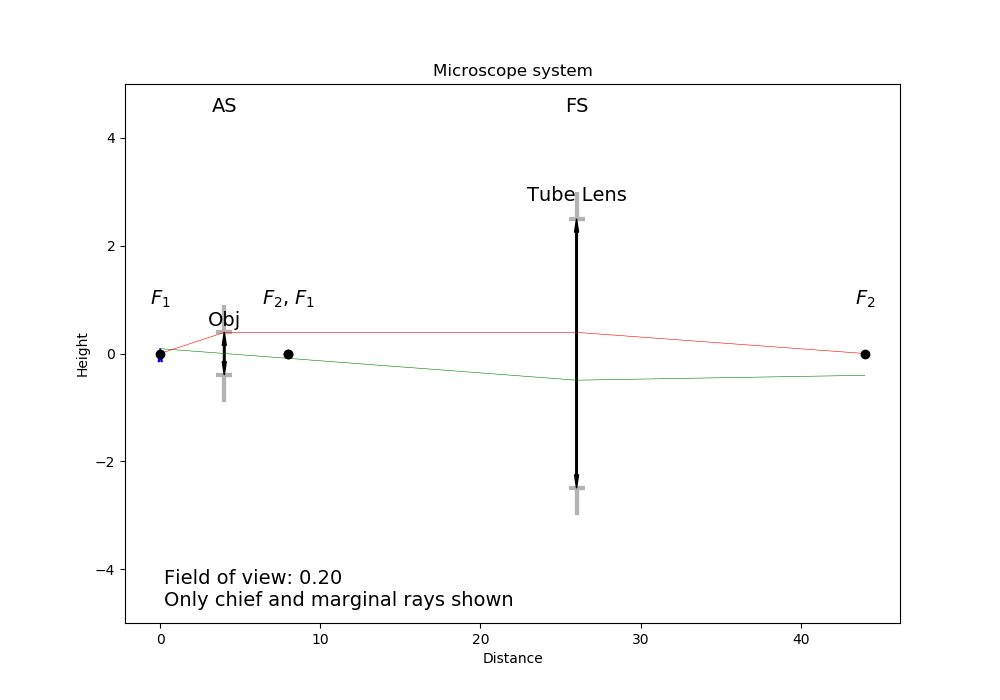

# RayTracing

by [Daniel Côté](mailto:dccote@cervo.ulaval.ca?subject=Raytracing python module)


This code aims to provide a simple ray tracing module for calculating various properties of optical paths (object, image, aperture stops, field stops).  It makes use of ABCD matrices and does not consider aberrations (spherical or chromatic). Since it uses the ABCD formalism (or Ray matrices, or Gauss matrices) it can perform tracing of rays but also gaussian laser beams. 

It is not a package to do "Rendering in 3D with raytracing".  

The code has been developed first for teaching purposes and is used in my "[Optique](https://itunes.apple.com/ca/book/optique/id949326768?mt=11)" Study Notes (french only), but also for actual use in my research. I have made no attempts at making high performance code.  **Readability** and **simplicity of usage** are the key here. It is a module with only a few files, and only `matplotlib` as a dependent module.

The module defines `Ray` , `Matrix`, `MatrixGroup` and `ImagingPath` as the main elements for tracing rays.  `Matrix` and `MatrixGroup` are either one or a sequence of many matrices into which `Ray` will propagate. `ImagingPath` is also a sequence of elements, with an object at the front edge.  Specific subclasses of `Matrix` exists: `Space`, `Lens`, `ThicklLens`, and `Aperture`. Finally, a ray fan is a collection of rays, originating from a given point with a range of angles.

If you want to perform calculations with coherent laser beams, then you use `GaussianBeam` and `LaserPath`. Everything is essentially the same, except that the formalism does not allow for the gaussian beam to be "blocked", hence any calculation of stops with aperture are not available in `LaserPath`.

## Installing and upgrading

You need `matplotlib`, which is a fairly standard Python module. If you do not have it,  installing [Anaconda](https://www.anaconda.com/download/) is your best option. You should choose Python 3.7 or later. There are several ways to install the module:

1. Simplest: `pip install raytracing` or `pip install --upgrade raytracing`
2. If you download the [source](https://pypi.org/project/raytracing/) of the module, then you can type: `python setup.py install`
3. From GitHub, you can get the latest version (including bugs) and then type `python setup.py install`
4. If you are completely lost, copying the folder `raytracing` (the one that includes `__init__.py`) from the source file into the same directory as your own script will work.

## Getting started

The simplest way to import the package in your own scripts after installing it:

```python
from raytracing import *
```

This will import `Ray` , `GaussianBeam`,  and several `Matrix` elements such as `Space`, `Lens`, `ThickLens`, `Aperture`, `DielectricInterface`, but also `MatrixGroup` (to group elements together),  `ImagingPath` (to ray trace with an object at the front edge), `LaserPath` (to trace a gaussian laser beam from the front edge) and a few predefined other such as `Objective` (to create a very thick lens that mimicks an objective).

You create an `ImagingPath` or a `LaserPath`, which you then populate with optical elements such as `Space`, `Lens` or `Aperture` or vendor lenses. You can then adjust the path properties (object height in `ImagingPath` for instance or inputBeam for `LaserPath`) and display in matplotlib. You can create a group of elements with `MatrixGroup` for instance a telescope, a retrofocus or any group of optical elements you would like to treat as a "group".  The Thorlabs and Edmund optics lenses, for instance, are defined as `MatrixGroups`.

This will show you a few examples of things you can do:

```shell
python -m raytracing
```

or request help with:

```
python -m raytracing -h
```

In your code, (such as the `test.py` or `demo.py`  files included in the [source](https://pypi.org/project/raytracing/)), you would do this:

```python
from raytracing import *

path = ImagingPath()
path.append(Space(d=100))
path.append(Lens(f=50, diameter=25))
path.append(Space(d=120))
path.append(Lens(f=70))
path.append(Space(d=100))
path.display()
```

You can also call display() on an element to see the cardinal points, principal planes, BFL and FFL. You can do it with any single `Matrix` element but also with `MatrixGroup`.

```
from raytracing import *

thorlabs.AC254_050_A().display()
eo.PN_33_921().display()
```

## Documentation

The class hierarchy for optical elements (with parameters and defaults) is:



Documentation is sparse at best.   You may obtain help by:

1. Reading an automatically generated documentation from the code (not that good-looking, but at least it is *some* documentation):
   1. Core: 
      1. [`Ray`](http://htmlpreview.github.io/?https://github.com/DCC-Lab/RayTracing/blob/master/docs/raytracing.ray.html): a ray for geometrical optics with a height and angle $y$ and $\theta$.
      2. [`GaussianBeam`](http://htmlpreview.github.io/?https://github.com/DCC-Lab/RayTracing/blob/master/docs/raytracing.gaussianbeam.html): a gaussian laser beam with complex radius of curvature $q$.
      3. [`Matrix`](http://htmlpreview.github.io/?https://github.com/DCC-Lab/RayTracing/blob/master/docs/raytracing.matrix.html): any 2x2 matrix.
      4. [`MatrixGroup`](http://htmlpreview.github.io/?https://github.com/DCC-Lab/RayTracing/blob/master/docs/raytracing.matrixgroup.html): treats a group of matrix as a unit (draws it as a unit too)
      5. [`ImagingPath`](http://htmlpreview.github.io/?https://github.com/DCC-Lab/RayTracing/blob/master/docs/raytracing.imagingpath.html): A `MatrixGroup` with an object at the front for geometrical optics 
      6. [`LaserPath`](http://htmlpreview.github.io/?https://github.com/DCC-Lab/RayTracing/blob/master/docs/raytracing.laserpath.html): A `MatrixGroup` with a laser beam input at the front or a Resonator.
   2. [Optical elements:](http://htmlpreview.github.io/?https://github.com/DCC-Lab/RayTracing/blob/master/docs/raytracing.matrix.html) `Aperture`, `Space`, `Lens`, `DielectricInterface`, `DielectricSlab`, `ThickLens`
   3. [Specialty lenses:](http://htmlpreview.github.io/?https://github.com/DCC-Lab/RayTracing/blob/master/docs/raytracing.specialtylenses.html) Defines a general achromat and objective lens
   4. [Thorlabs lenses:](http://htmlpreview.github.io/?https://github.com/DCC-Lab/RayTracing/blob/master/docs/raytracing.thorlabs.html) Achromat doublet lenses from Thorlabs.
   5. [Edmund Optics lenses:](http://htmlpreview.github.io/?https://github.com/DCC-Lab/RayTracing/blob/master/docs/raytracing.eo.html) Achromat doublet lenses from Edmund Optics
   6. [Olympus objectives:](http://htmlpreview.github.io/?https://github.com/DCC-Lab/RayTracing/blob/master/docs/raytracing.olympus.html) A few objectives from Olympus.
   7. [Glasses:](http://htmlpreview.github.io/?https://github.com/DCC-Lab/RayTracing/blob/master/docs/raytracing.materials.html) A few glasses used by Thorlabs to make achromatic doublets. They all have a single function n(wavelength) that returns the index at that wavelength.  All data obtained from http://refractiveindex.info.
2. typing (interactively): `help(Matrix)`,`help(MatrixGroup)` `help(Ray)`,`help(ImagingPath)` to get the API, 
3. look at the examples with `python -m raytracing` 
4. simply look at the code.

```python
python
>>> help(Matrix)
Help on class Matrix in module raytracing.abcd:

class Matrix(builtins.object)
 |  Matrix(A, B, C, D, physicalLength=0, apertureDiameter=inf, label='')
 |  
 |  A matrix and an optical element that can transform a ray or another
 |  matrix.
 |  
 |  The general properties (A,B,C,D) are defined here. The operator "*" is
 |  overloaded to allow simple statements such as:
 |  
 |  ray2 = M1 * ray
 |  or
 |  M3 = M2 * M1
 |  
 |  The physical length is included in the matrix to allow simple management of
 |  the ray tracing. IF two matrices are multiplied, the resulting matrice
 |  will have a physical length that is the sum of both matrices.
 |  
 |  In addition finite apertures are considered: if the apertureDiameter
 |  is not infinite (default), then the object is assumed to limit the
 |  ray height to plus or minus apertureDiameter/2 from the front edge to the back
 |  edge of the element.
 |  
 |  Methods defined here:
 |  
 |  __init__(self, A, B, C, D, physicalLength=0, apertureDiameter=inf, label='')
 |      Initialize self.  See help(type(self)) for accurate signature.
 |  
 |  __mul__(self, rightSide)
 |      Operator overloading allowing easy to read matrix multiplication
 |      
 |      For instance, with M1 = Matrix() and M2 = Matrix(), one can write
 |      M3 = M1*M2. With r = Ray(), one can apply the M1 transform to a ray
 |      with r = M1*r
 |  
 |  __str__(self)
 |      String description that allows the use of print(Matrix())
 |  
 |  backwardConjugate(self)
 |      With an image at the back edge of the element,
 |      where is the object ? Distance before the element by
 |      which a ray must travel to reach the conjugate plane at
 |      the back of the element. A positive distance means the
 |      object is "distance" in front of the element (or to the
 |      left, or before).
 |      
 |      M2 = M1*Space(distance)
 |      # M2.isImaging == True

```

## Examples

In the [examples](https://github.com/DCC-Lab/RayTracing/tree/master/examples) directory, you can run `demo.py` to see a variety of systems, `illuminator.py` to see a Kohler illuminator, and `invariant.py` to see an example of the role of lens diameters to determine the field of view. However, you can also run the module directly with `python -m raytracing`, which will run the following code (`__main__.py`) to give you a flavour of what is possible:

```python
from .imagingpath import *
from .laserpath import *

from .specialtylenses import *
from .axicon import *
import raytracing.thorlabs as thorlabs
import raytracing.eo as eo
import raytracing.olympus as olympus

import argparse
ap = argparse.ArgumentParser(prog='python -m raytracing')
ap.add_argument("-e", "--examples", required=False, default='all', help="Specific example numbers, separated by a comma")

args = vars(ap.parse_args())
examples = args['examples']

if examples == 'all':
    examples = range(1,30)
else:
    examples = [ int(y) for y in examples.split(',')]

if 1 in examples:
    path = ImagingPath()
    path.label = "Demo #1: lens f = 5cm, infinite diameter"
    path.append(Space(d=10))
    path.append(Lens(f=5))
    path.append(Space(d=10))
    path.display(comments= """Demo #1: lens with f=5 cm, infinite diameter

    An object at z=0 (front edge) is used. It is shown in blue. The image (or any intermediate images) are shown in red.\n\
    This will use the default objectHeight and fanAngle but they can be changed with:
    path.objectHeight = 1.0
    path.fanAngle = 0.5
    path.fanNumber = 5
    path.rayNumber = 3

    Code:
    path = ImagingPath()
    path.label = "Demo #1: lens f = 5cm, infinite diameter"
    path.append(Space(d=10))
    path.append(Lens(f=5))
    path.append(Space(d=10))
    path.display()
    """)

if 2 in examples:
    path = ImagingPath()
    path.label = "Demo #2: Two lenses, infinite diameters"
    path.append(Space(d=10))
    path.append(Lens(f=5))
    path.append(Space(d=20))
    path.append(Lens(f=5))
    path.append(Space(d=10))
    path.display(comments="""Demo #2: Two lenses, infinite diameters
    An object at z=0 (front edge) is used with default properties (see Demo #1).

    Code:
    path = ImagingPath()
    path.label = "Demo #2: Two lenses, infinite diameters"
    path.append(Space(d=10))
    path.append(Lens(f=5))
    path.append(Space(d=20))
    path.append(Lens(f=5))
    path.append(Space(d=10))
    path.display()
    """)
    # or
    #path.save("Figure 2.pdf")

if 3 in examples:
    path = ImagingPath()
    path.label = "Demo #3: Finite lens"
    path.append(Space(d=10))
    path.append(Lens(f=5, diameter=2.5))
    path.append(Space(d=3))
    path.append(Space(d=17))
    path.display(comments="""Demo #3: A finite lens
    An object at z=0 (front edge) is used with default properties (see Demo #1). Notice the aperture stop (AS)
    identified at the lens which blocks the cone of light. There is no field stop to restrict the field of view,
    which is why we must use the default object and cannot restrict the field of view. Notice how the default
    rays are blocked.

    path = ImagingPath()
    path.objectHeight = 1.0    # object height (full).
    path.objectPosition = 0.0  # always at z=0 for now.
    path.fanAngle = 0.5        # full fan angle for rays
    path.fanNumber = 9         # number of rays in fan
    path.rayNumber = 3         # number of points on object
    path.label = "Demo #3: Finite lens"
    path.append(Space(d=10))
    path.append(Lens(f=5, diameter=2.5))
    path.append(Space(d=3))
    path.append(Space(d=17))
    path.display()
    """)
if 4 in examples:
    path = ImagingPath()
    path.label = "Demo #4: Aperture behind lens"
    path.append(Space(d=10))
    path.append(Lens(f=5, diameter=3))
    path.append(Space(d=3))
    path.append(Aperture(diameter=3))
    path.append(Space(d=17))
    path.display(comments="""Demo #4: Aperture behind lens

    Notice the aperture stop (AS) identified after the lens, not at the lens. Again, since there is no field stop,
    we cannot restrict the object to the field of view because it is infinite.

    Code:
    path = ImagingPath()
    path.label = "Demo #4: Aperture behind lens"
    path.append(Space(d=10))
    path.append(Lens(f=5, diameter=3))
    path.append(Space(d=3))
    path.append(Aperture(diameter=3))
    path.append(Space(d=17))
    path.display()
    """)
if 5 in examples:
    path = ImagingPath()
    path.label = "Demo #5: Simple microscope system"
    path.fanAngle = 0.1        # full fan angle for rays
    path.fanNumber = 5         # number of rays in fan
    path.rayNumber = 5         # number of points on object
    path.append(Space(d=4))
    path.append(Lens(f=4, diameter=0.8, label='Obj'))
    path.append(Space(d=4 + 18))
    path.append(Lens(f=18, diameter=5.0, label='Tube Lens'))
    path.append(Space(d=18))
    path.display(limitObjectToFieldOfView=True, comments="""# Demo #5: Simple microscope system
    The aperture stop (AS) is at the entrance of the objective lens, and the tube lens, in this particular microscope, is
    the field stop (FS) and limits the field of view. Because the field stop exists, we can use limitObjectToFieldOfView=True
    when displaying, which will set the objectHeight to the field of view, but will still trace all the rays using our parameters.

    path = ImagingPath()
    path.label = "Demo #5: Simple microscope system"
    path.fanAngle = 0.1        # full fan angle for rays
    path.fanNumber = 5         # number of rays in fan
    path.rayNumber = 5         # number of points on object
    path.append(Space(d=4))
    path.append(Lens(f=4, diameter=0.8, label='Obj'))
    path.append(Space(d=4 + 18))
    path.append(Lens(f=18, diameter=5.0, label='Tube Lens'))
    path.append(Space(d=18))
    path.display()
    """)
if 6 in examples:
    path = ImagingPath()
    path.label = "Demo #6: Simple microscope system, only principal rays"
    path.append(Space(d=4))
    path.append(Lens(f=4, diameter=0.8, label='Obj'))
    path.append(Space(d=4 + 18))
    path.append(Lens(f=18, diameter=5.0, label='Tube Lens'))
    path.append(Space(d=18))
    path.display(limitObjectToFieldOfView=True, onlyChiefAndMarginalRays=True,
        comments="""# Demo #6: Simple microscope system, only principal rays
    The aperture stop (AS) is at the entrance of the objective lens, and the tube lens, in this particular microscope, is
    the field stop (FS) and limits the field of view. Because the field stop exists, we can use limitObjectToFieldOfView=True
    when displaying, which will set the objectHeight to the field of view. We can also require that only the principal rays are drawn: chief ray
    marginal ray (or axial ray).

    path = ImagingPath()
    path.label = "Demo #6: Simple microscope system, only principal rays"
    path.append(Space(d=4))
    path.append(Lens(f=4, diameter=0.8, label='Obj'))
    path.append(Space(d=4 + 18))
    path.append(Lens(f=18, diameter=5.0, label='Tube Lens'))
    path.append(Space(d=18))
    path.display()
    """)
if 7 in examples:
    path = ImagingPath()
    path.label = "Demo #7: Focussing through a dielectric slab"
    path.append(Space(d=10))
    path.append(Lens(f=5))
    path.append(Space(d=3))
    path.append(DielectricSlab(n=1.5, thickness=4))
    path.append(Space(d=10))
    path.display(comments=path.label+"""\n
    path = ImagingPath()
    path.label = "Demo #7: Focussing through a dielectric slab"
    path.append(Space(d=10))
    path.append(Lens(f=5))
    path.append(Space(d=3))
    path.append(DielectricSlab(n=1.5, thickness=4))
    path.append(Space(d=10))"""
    )
if 8 in examples:
    # Demo #8: Virtual image
    path = ImagingPath()
    path.label = "Demo #8: Virtual image at -2f with object at f/2"
    path.append(Space(d=2.5))
    path.append(Lens(f=5))
    path.append(Space(d=10))
    path.display(comments=path.label+"""\n
    path = ImagingPath()
    path.label = "Demo #8: Virtual image at -2f with object at f/2"
    path.append(Space(d=2.5))
    path.append(Lens(f=5))
    path.append(Space(d=10))
    path.display()""")
if 9 in examples:
    # Demo #9: Infinite telecentric 4f telescope
    path = ImagingPath()
    path.label = "Demo #9: Infinite telecentric 4f telescope"
    path.append(Space(d=5))
    path.append(Lens(f=5))
    path.append(Space(d=10))
    path.append(Lens(f=5))
    path.append(Space(d=5))
    path.display(comments=path.label+"""\n
    path = ImagingPath()
    path.label = "Demo #9: Infinite telecentric 4f telescope"
    path.append(Space(d=5))
    path.append(Lens(f=5))
    path.append(Space(d=10))
    path.append(Lens(f=5))
    path.append(Space(d=5))
    """)
if 10 in examples:
    path = ImagingPath()
    path.fanAngle = 0.05
    path.append(Space(d=20))
    path.append(Lens(f=-10, label='Div'))
    path.append(Space(d=7))
    path.append(Lens(f=10, label='Foc'))
    path.append(Space(d=40))
    (focal,focal) = path.effectiveFocalLengths()
    bfl = path.backFocalLength()
    path.label = "Demo #10: Retrofocus $f_e$={0:.1f} cm, and BFL={1:.1f}".format(focal, bfl)
    path.display(comments=path.label+"""\n
    A retrofocus has a back focal length longer than the effective focal length. It comes from a diverging lens followed by a converging
    lens. We can always obtain the effective focal lengths and the back focal length of a system.

    path = ImagingPath()
    path.fanAngle = 0.05
    path.append(Space(d=20))
    path.append(Lens(f=-10, label='Div'))
    path.append(Space(d=7))
    path.append(Lens(f=10, label='Foc'))
    path.append(Space(d=40))
    (focal,focal) = path.effectiveFocalLengths()
    bfl = path.backFocalLength()
    path.label = "Demo #10: Retrofocus $f_e$={0:.1f} cm, and BFL={1:.1f}".format(focal, bfl)
    path.display()
    """)
if 11 in examples:
    # Demo #11: Thick diverging lens
    path = ImagingPath()
    path.label = "Demo #11: Thick diverging lens"
    path.objectHeight = 20
    path.append(Space(d=50))
    path.append(ThickLens(R1=-20, R2=20, n=1.55, thickness=10, diameter=25, label='Lens'))
    path.append(Space(d=50))
    path.display(onlyChiefAndMarginalRays=True, comments=path.label+"""\n
    path = ImagingPath()
    path.label = "Demo #11: Thick diverging lens"
    path.objectHeight = 20
    path.append(Space(d=50))
    path.append(ThickLens(R1=-20, R2=20, n=1.55, thickness=10, diameter=25, label='Lens'))
    path.append(Space(d=50))
    path.display()""")
if 12 in examples:
    # Demo #12: Thick diverging lens built from individual elements
    path = ImagingPath()
    path.label = "Demo #12: Thick diverging lens built from individual elements"
    path.objectHeight = 20
    path.append(Space(d=50))
    path.append(DielectricInterface(R=-20, n1=1.0, n2=1.55, diameter=25, label='Front'))
    path.append(Space(d=10, diameter=25, label='Lens'))
    path.append(DielectricInterface(R=20, n1=1.55, n2=1.0, diameter=25, label='Back'))
    path.append(Space(d=50))
    path.display(onlyChiefAndMarginalRays=True, comments=path.label+"""\n
    path = ImagingPath()
    path.label = "Demo #12: Thick diverging lens built from individual elements"
    path.objectHeight = 20
    path.append(Space(d=50))
    path.append(DielectricInterface(R=-20, n1=1.0, n2=1.55, diameter=25, label='Front'))
    path.append(Space(d=10, diameter=25, label='Lens'))
    path.append(DielectricInterface(R=20, n1=1.55, n2=1.0, diameter=25, label='Back'))
    path.append(Space(d=50))
    path.display()""")

if 13 in examples:
    # Demo #13, forward and backward conjugates
    # We can obtain the position of the image for any matrix
    # by using forwardConjugate(): it calculates the distance
    # after the element where the image is, assuming an object
    # at the front surface.
    M1 = Space(d=10)
    M2 = Lens(f=5)
    M3 = M2*M1
    print(M3.forwardConjugate())
    print(M3.backwardConjugate())
if 14 in examples:
    # Demo #14: Generic objectives
    obj = Objective(f=10, NA=0.8, focusToFocusLength=60, backAperture=18, workingDistance=2, label="Objective")
    print("Focal distances: ", obj.focalDistances())
    print("Position of PP1 and PP2: ", obj.principalPlanePositions(z=0))
    print("Focal spots positions: ", obj.focusPositions(z=0))
    print("Distance between entrance and exit planes: ", obj.L)

    path = ImagingPath()
    path.fanAngle = 0.0
    path.fanNumber = 1
    path.rayNumber = 15
    path.objectHeight = 10.0
    path.label = "Demo #14 Path with generic objective"
    path.append(Space(180))
    path.append(obj)
    path.append(Space(10))
    path.display(comments=path.label+"""
    path = ImagingPath()
    path.fanAngle = 0.0
    path.fanNumber = 1
    path.rayNumber = 15
    path.objectHeight = 10.0
    path.label = "Path with generic objective"
    path.append(Space(180))
    path.append(obj)
    path.append(Space(10))
    path.display()""")
if 15 in examples:
    # Demo #15: Olympus objective LUMPlanFL40X
    path = ImagingPath()
    path.fanAngle = 0.0
    path.fanNumber = 1
    path.rayNumber = 15
    path.objectHeight = 10.0
    path.label = "Demo #15 Path with LUMPlanFL40X"
    path.append(Space(180))
    path.append(olympus.LUMPlanFL40X())
    path.display(comments=path.label+"""
    path = ImagingPath()
    path.fanAngle = 0.0
    path.fanNumber = 1
    path.rayNumber = 15
    path.objectHeight = 10.0
    path.label = "Path with LUMPlanFL40X"
    path.append(Space(180))
    path.append(olympus.LUMPlanFL40X())
    path.append(Space(10))
    path.display()""")
if 16 in examples:
    # Demo #16: Vendor lenses
    thorlabs.AC254_050_A().display()
    eo.PN_33_921().display()
if 17 in examples:
    # Demo #17: Vendor lenses
    path = ImagingPath()
    path.label = "Demo #17: Vendor Lenses"
    path.append(Space(d=50))
    path.append(thorlabs.AC254_050_A())
    path.append(Space(d=50))
    path.append(thorlabs.AC254_050_A())
    path.append(Space(d=150))
    path.append(eo.PN_33_921())
    path.append(Space(d=50))
    path.append(eo.PN_88_593())
    path.append(Space(180))
    path.append(olympus.LUMPlanFL40X())
    path.append(Space(10))
    path.display(comments=path.label+"""\n
    path = ImagingPath()
    path.label = "Demo #17: Vendor Lenses"
    path.append(Space(d=50))
    path.append(thorlabs.AC254_050_A())
    path.append(Space(d=50))
    path.append(thorlabs.AC254_050_A())
    path.append(Space(d=150))
    path.append(eo.PN_33_921())
    path.append(Space(d=50))
    path.append(eo.PN_88_593())
    path.append(Space(180))
    path.append(olympus.LUMPlanFL40X())
    path.append(Space(10))
    path.display()""")
if 18 in examples:
    # Demo #18: Laser beam and vendor lenses
    path = LaserPath()
    path.label = "Demo #18: Laser beam and vendor lenses"
    path.append(Space(d=50))
    path.append(thorlabs.AC254_050_A())
    path.append(Space(d=50))
    path.append(thorlabs.AC254_050_A())
    path.append(Space(d=150))
    path.append(eo.PN_33_921())
    path.append(Space(d=50))
    path.append(eo.PN_88_593())
    path.append(Space(d=180))
    path.append(olympus.LUMPlanFL40X())
    path.append(Space(d=10))
    path.display(inputBeam=GaussianBeam(w=0.001), comments="""
    path = LaserPath()
    path.label = "Demo #18: Laser beam and vendor lenses"
    path.append(Space(d=50))
    path.append(thorlabs.AC254_050_A())
    path.append(Space(d=50))
    path.append(thorlabs.AC254_050_A())
    path.append(Space(d=150))
    path.append(eo.PN_33_921())
    path.append(Space(d=50))
    path.append(eo.PN_88_593())
    path.append(Space(d=180))
    path.append(olympus.LUMPlanFL40X())
    path.append(Space(d=10))
    path.display()""")
if 19 in examples:
    cavity = LaserPath(label="Laser cavity: round trip\nCalculated laser modes")
    cavity.isResonator = True
    cavity.append(Space(d=160))
    cavity.append(DielectricSlab(thickness=100, n=1.8))
    cavity.append(Space(d=160))
    cavity.append(CurvedMirror(R=400))
    cavity.append(Space(d=160))
    cavity.append(DielectricSlab(thickness=100, n=1.8))
    cavity.append(Space(d=160))

    # Calculate all self-replicating modes (i.e. eigenmodes)
    (q1,q2) = cavity.eigenModes()
    print(q1,q2)

    # Obtain all physical (i.e. finite) self-replicating modes
    qs = cavity.laserModes()
    for q in qs:
        print(q)

    # Show
    cavity.display()
```






## Known limitations

There are no known bugs in the actual calculations, but there are bugs or limitations in the display:

1. It is not easy to put several labels on a graph without any overlap.  I am still working on it.
2. It is also not easy to figure out what "the right size" should be for an arrow head, the font, the position of a label, the size of the "ticks" on the aperture.
3. Labelling focal points with appropriate secondary labels should be possible, maybe a superscript?
4. The y-scale is not always set appropriately when the elements have infinite diameters: the rays will go beyond the element drawn on the figure.

## Licence

This code is provided under the [MIT License](./LICENSE).