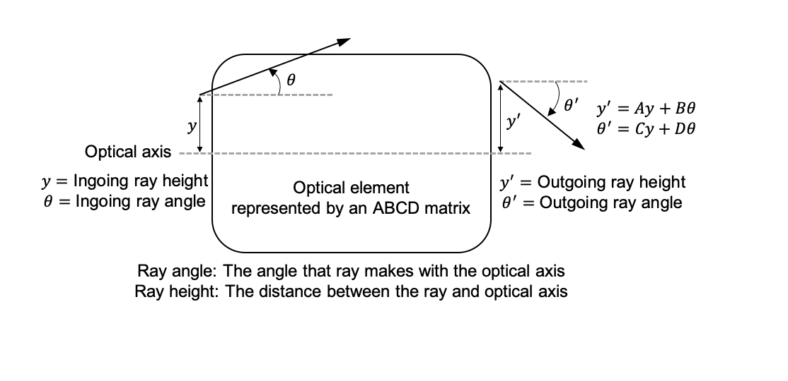
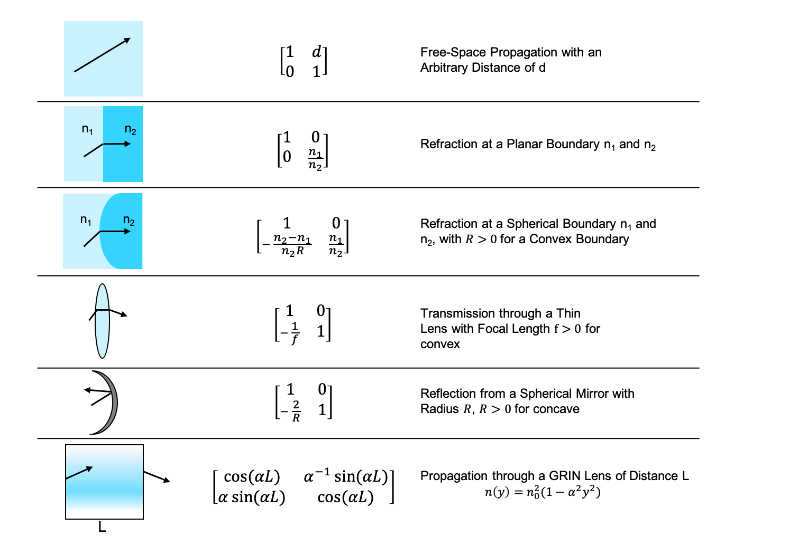

# Tools and tutorial on practical ray tracing for microscopy

Best viewed and edited with [Typora](http://typora.io).

>  This file is public on the RayTracing repository, but cannot be copied outside of the DCCLab group: we are working on an article, and I purposely left the file on GitHub.  I understand people outside the group may see the article before it is complete but the file is copyrighted to the group and the authors. Do not use or distribute outside of DCCLab.
>
> Daniel Cote, May 5th, 2020, dccote@cervo.ulaval.ca

[TOC]

## Authors

**Very likely:** Valérie Pineau Noel, Elahe Parham, Shadi Massoumi, François Côté

**Possible:** Gabriel Genest, Ludovick Bégin, Marc-André Vigneault, others

**Certain**: Daniel C. Côté

## Abstract

1. Simple optical design, first line of defense: objects, images, but also apertures, aperture stops, field stops, and invariant
2. **For students and non optical designers**
3. Simple Python library for tracing rays, few dependencies: only depends on `matplotlib`, Python >3.6
4. Documented code, simplicity before power, but still, very powerful.

## Introduction

- Optical design is everywhere, although not referred to by this name. Students need to know certain system properties to successfully build their systems. However, not everyone has the knowledge from undergraduate courses or experience. Of course, when needed eventually, many people dig in and figure it out, but not everyone actually digs in. This in fact, includes many people such as the last author of this article.
- Tedious to obtain numbers even if formalism is not particularly complicated
- Zemax, CodeV and others have a steep learning curve.
- This Python module is designed to provide answers (and teach!) to non-experts so they can identify weaknesses in their optical systems, in particular microscopes, but also fiber-based devices or illumination devices. 

## Formalism

### Rays through optical elements

For completeness, we start with a very compact introduction to the ray matrix formalism.  The ABCD matrix formalism (or ray matrices) allows a ray (column vector) to be transformed from one reference plane to another through different optical elements (represented by matrices). A ray is defined as :
$$
\mathbf{r} \equiv \Biggl[ \begin{matrix}
y \\
\theta \\
\end{matrix} \Biggr]
$$
with $y$ the distance to the optical axis and $\theta$ the angle that this beam makes with the optical axis of the system. The optical axis of an optical system is defined as the imaginary line passing through the center of the elements. Note that there are other definitions of the ray by some authors that include the index of refraction directly in the ray definition, but these are not used here **[Reference?]**. A set of $2 \times 2$ matrices is used to represent the transformations that optical elements impart on the ray. A matrix is represented in general by:

$$
\mathbf{M} = \Biggl[ 
\begin{matrix}
A & B \\
C & D
\end{matrix}
\Biggr]
$$

and describes everything about the transformation of a ray between two reference planes. It transforms a ray with a left-multiplication $\mathbf{r}^\prime = \mathbf{M} \mathbf{r}$, which gives explicitly:

$$
y^\prime = A y + B \theta,
$$

$$
\theta^\prime = C y + D \theta.
$$
**[Redo this figure better? translate, also add vertices and length ]** 

There really are only two transformations that need to be described to recover the behavior of any optical elements: the propagation by a distance $d$ in any homogeneous medium, described by the simple following matrix :
$$
\mathbf{S}(d) = \Biggl[ 
\begin{matrix}
1 & d \\
0 & 1
\end{matrix}
\Biggr],
$$
 and the crossing of a ray from a dielectric medium of index $n_1$ to a medium of index $n_2$ through a curved interface of radius $R$ (with $R>0$ when convex):
$$
\mathbf{D}(n_1, n_2, R) = 
\Biggr[
\begin{matrix}
1 & 0 \\
-\frac{n_2-n_1}{n_2 R} & \frac{n_1}{n_2}
\end{matrix}
\Biggl],
$$
which can be derived using geometry and Snell's law.  We note that the determinant in general is:

$$
\det\ \mathbf{M} = AD-BC=\frac{n_1}{n_2},
$$
where $n_1$ is the refractive index at the entry plane and $n_2$ at the exit plane. A ray $\mathbf{r}$ that crosses the elements  $\mathbf{M}_1,\mathbf{M}_2,\mathbf{M}_3, ... \mathbf{M}_i$ will be transformed into $\mathbf{r}^\prime$ by the sequential *left* application of the matrices representing the elements (note the order of multiplication): 

$$
\mathbf{r}^\prime = \mathbf{M}_i,...\mathbf{M}_3,\mathbf{M}_2 \mathbf{M}_1 \mathbf{r} = \mathbf{M} \mathbf{r}.
$$

### Useful properties

From this, we can already extract important properties for any optical systems:

1. When $B=0$, we have an **imaging condition** where an object at the entrance is imaged at the exit plane, since a ray originating from a height $y$ reaches a height $y^\prime=Ay$, independent of the angle of emission $\theta$. Naturally, $A$ is the transverse magnification, and $D$ is the angular magnification. *[show a figure.]*,
2. **The equivalent focal distance** for any system is $C = -\frac{1}{f}$ *[Check index of refraction  show a figure.]*,
3. **Principal planes:** Focal distances are measured from principal planes, which are planes of unity magnification in any systems where all the focusing power is concentrated. They are located at $L_\mathrm{PP_i} = \frac{{{n_1}/{n_2} - D}}{C}$ and $L_\mathrm{PP_o} = \frac{{1 - A}}{C}$. *[Explain and discuss signs, show a figure*]
4. **Optical invariant:** Finally, it can be shown that the product $n ( y_1 \theta_2 - y_2 \theta_1)$ for any two rays at a given point is a constant throughout the system.  Therefore if a component cannot "support" a certain product, then it becomes clear the rays will be blocked.

### Use of formalism in examples

We can easily recover the position of an image with respect to the position of an object  with a thin lens matrix:
$$
\mathbf{S}(d_i) \mathbf{L}(f) \mathbf{S}(d_o) =
\Biggr[
\begin{matrix}
1 - \frac{d_i}{f} & d_o + d_i \left( 1 - \frac{d_o}{f}\right) \\
-\frac{1}{f} & 1-\frac{s_o}{f}
\end{matrix}
\Biggl].
$$
With $d_o + d_i \left( 1 - \frac{d_o}{f}\right) = 0$ (i.e. the imaging condition), we can simplify to the well known $\frac{1}{d_o} + \frac{1}{d_i} = \frac{1}{f}$, with distance $d_o, d_i$ positive for real objects and images.

Although we always use the thin lens matrix, it is simple to obtain an expression for the focal length of a thin lens made of a material of index $n$ and two curved surfaces of radii $R_1$ and $R_2$ with :
$$
\Biggr[
\begin{matrix}
1 & 0 \\
-\frac{1-n}{R_2} & n
\end{matrix}
\Biggl]
\Biggr[
\begin{matrix}
1 & 0 \\
-\frac{n-1}{n R_1} & \frac{1}{n}
\end{matrix}
\Biggl]
=
\Biggr[
\begin{matrix}
1 & 0 \\
-(n-1)\left( \frac{1}{R_1} - \frac{1}{R_2}  \right) & 1
\end{matrix}
\Biggl]
\equiv
\Biggr[
\begin{matrix}
1 & 0 \\
-\frac{1}{f} & 1
\end{matrix}
\Biggl]
.
$$
We recover the Lensmaker equation for thin lenses with $C = -1/f$. Of course, within the paraxial equation more complex lenses can be modelled such as achromatic doublets. Thorlabs and Edmund Optics for instance both provide the three radii of curvatures $R_1, R_2, R_3$ of dielectric interfaces as well as the thickness $t_1, t_2$ and indices $n_1,n_2$ of both materials required to compute the properties of their doublets.  It becomes a simple application of the formalism to recover the expected focal length from an achromatic doublets in air with:
$$
\mathbf{L}_\text{AD}(R_1,R_2,R_3,t_1, t_2, n_1, n_2) \equiv \mathbf{D}(R_3, n_2, 1)\mathbf{S}(t_2)\mathbf{D}(R_2, n_1, n_2)\mathbf{S}(t_1)\mathbf{D}(R_1, 1, n_1).
$$
where the equivalent focal length and the principal planes are obtained.  It will be shown below that many achromatic lenses from manufacturers are included in the module.

Finally, we can see how a scanning mirror in a microscope is used to scan an incident laser when positionned at the focal spot of a lens. The effect of a mirror on an incident ray is to divert the ray by an angle $\theta$ (the optical angle) when it itself mechanically rotated by an angle $\theta/2$ (the mechanical angle). When this mirror is positionned at the focal point of a lens, we obtain at the other focal plane:
$$
\Biggr[
\begin{matrix}
1 & f \\
0 & 1
\end{matrix}
\Biggl]
\Biggr[
\begin{matrix}
1 & 0 \\
-\frac{1}{f} & 1
\end{matrix}
\Biggl]
\Biggr[
\begin{matrix}
1 & f \\
0 & 1
\end{matrix}
\Biggl]

\Biggr[
\begin{matrix}
0 \\
\theta(t)
\end{matrix}
\Biggl]
=
\Biggr[
\begin{matrix}
0 & f \\
-\frac{1}{f} & 0
\end{matrix}
\Biggl]
\Biggr[
\begin{matrix}
0 \\
\theta(t)
\end{matrix}
\Biggl]
=
\Biggr[
\begin{matrix}
f \theta(t) \\
0
\end{matrix}
\Biggl].
$$
The modulation pattern on $\theta(t)$ is translated to a raster scan in $y(t) = f\theta(t)$, as desired in scanning microscopes. 

 **[Reference for this figure?]**

## Apertures

This section contains a description of apertures, how they are not considered in ABCD formalism but can easily be added and how they lead to **Aperture Stop** and **Field Stop**. A section describes the procedure to find the aperture and field stop.

Explain difference between matrix multiplications and tracing: tracing considers apertures but multiplications do not.  Tracing is a multi-step procedure involving ABCD matrix multiplications.

**Chief** and **marginal** rays (validate definitions, especially axial or marginal ray?). Simple proof to obtain chief and axial ray and that these two rays are sufficient to describe the light through whole system.

## Collection of rays: as inputs and outputs

To obtain the (relative) intensity of a point on an object, we can trace many rays and collect a histogram of rays as a function of position.

Example: Uniform (validate math!), LambertianRays, 

## Gaussian beams

Free bonus: gaussian beams can use ray matrices (but not apertures).

## `raytracing` module

**A section describes the design goals:** 

1. Simplicity of usage
2. Simplicity of implementation (i.e. code)
3. Provides answers to common questions encountered in the lab
4. Useful teaching tool in optics
   1. Illustration of strategies with real-life examples
   2. Validation of strategies to be taught
   3. Provides real figures to be used in presentations.
   4. Real lenses from real vendors with calculated properties
5. Useful teaching tool in programming
   1. Good object-oriented design that matches "the problem at hand"
   2. Simple, clear implementation following Clean Code practices.
   3. Properly documented
   4. Properly unit tested
   5. Implanted as an easy installable Python module and PyPi.
6. Open sourced

## Object-oriented design

*Everything is a matrix.  Ray matrices combine to give another ray matrix. Yet, not every matrix (or optical path) is an imaging system (for instance, with can model an illumination system, which does not consist of an object and an image). Describe the class hierarchy and show a figure.* `Matrix`, `MatrixGroup`, `OpticalPath`, `ImagingPath`, `Laserpath`.

Explain difference between matrix multiplications and tracing: tracing considers apertures but multiplications do not.

## Example use:

Relevant examples of how to use the code.

Prepare many different examples, keep them in a directory and show figures.

## Practical examples solved with module

###Widefield microscope

###Simple scanning system

###Laser scanning microscope

###Diffuse source from scattering medium

### Confocal pinhole detection

**[1]. Pawley, James, ed. Handbook of biological confocal microscopy. Vol. 236. Springer Science & Business Media, 2006.
[2]. Veilleux, Israel, et al. "In vivo cell tracking with video rate multimodality laser scanning microscopy." IEEE Journal of selected topics in quantum electronics 14.1 (2008): 10-18.**

**Add microscope setup in figure from [2]**

In confocal laser scanning microscopy, the pinhole must match the size of the Airy disk formed at the sample to produce a good optical sectioning [1]. Since the pinhole size plays an important role for the optimization of a confocal system, here we present a way to use the RayTracing module to better understand the impact of tuning the pinhole size of a confocal microscope. The way this works is by sending a large number of rays in the system and computing how many make it through the pinhole. As it can be noticed in Fig x(b), as soon as the pinhole diameter is smaller than the size fitting the focal spot, the transmission efficiency linearly decreases.

**Caption : Figure x(b) shows the transmission efficiency according to the different pinhole size of the confocal microscope Figx(a) [2].**

###Two-photon descanned detector

###Big detectors (R3896) versus small detectors (GaAsP)

###Illumination system

###Axicon

###Fiber-based collection system

Discussion and outlook:

Examples of things that could be added:

1. Scanning mirrors.

2. Extract wavefronts 

3. GUI, but not within main code: avoid Zawinski's law of software envelopment (also known as *Zawinski's law*) and [software bloating](https://en.wikipedia.org/wiki/Software_bloat) with popular features:[[13\]](https://en.wikipedia.org/wiki/Jamie_Zawinski#cite_note-aoup-13)[[14\]](https://en.wikipedia.org/wiki/Jamie_Zawinski#cite_note-jf-14)

   > Every program attempts to expand until it can read [mail](https://en.wikipedia.org/wiki/E-mail). Those programs which cannot so expand are replaced by ones which can.

4. Misaligned matrices

5. Polarization

6. 3D rays and 3D rendering 3D export of optical systems

7. Reflections

8. 

